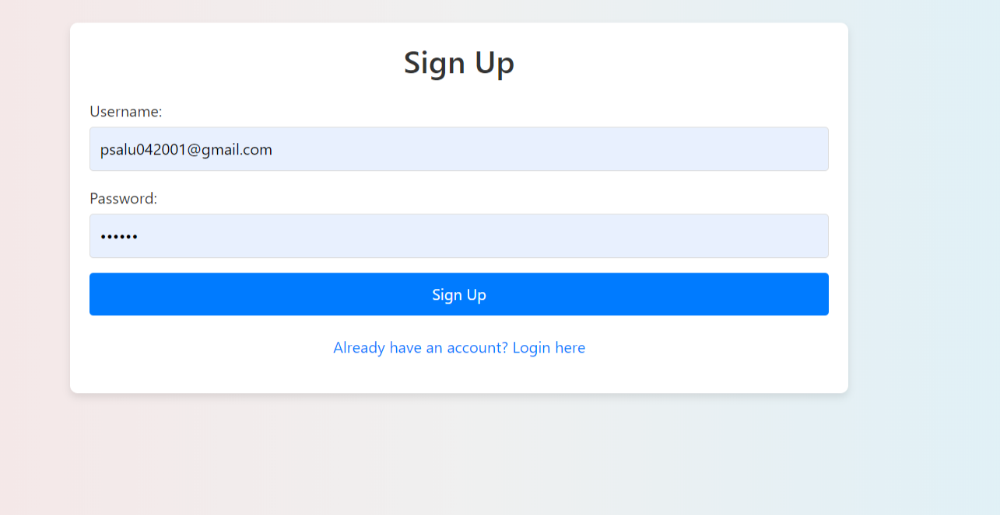
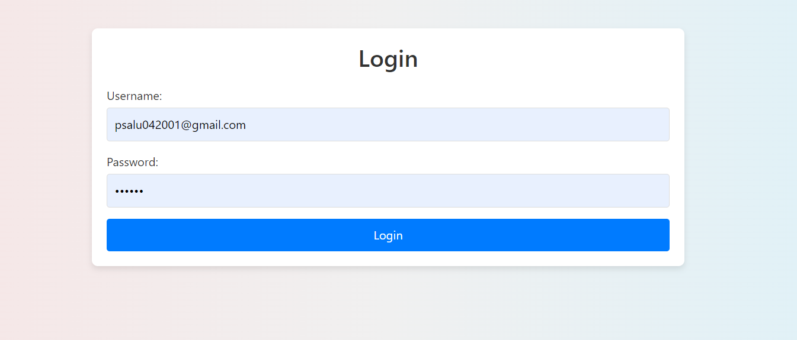
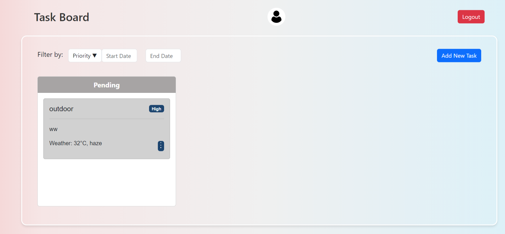
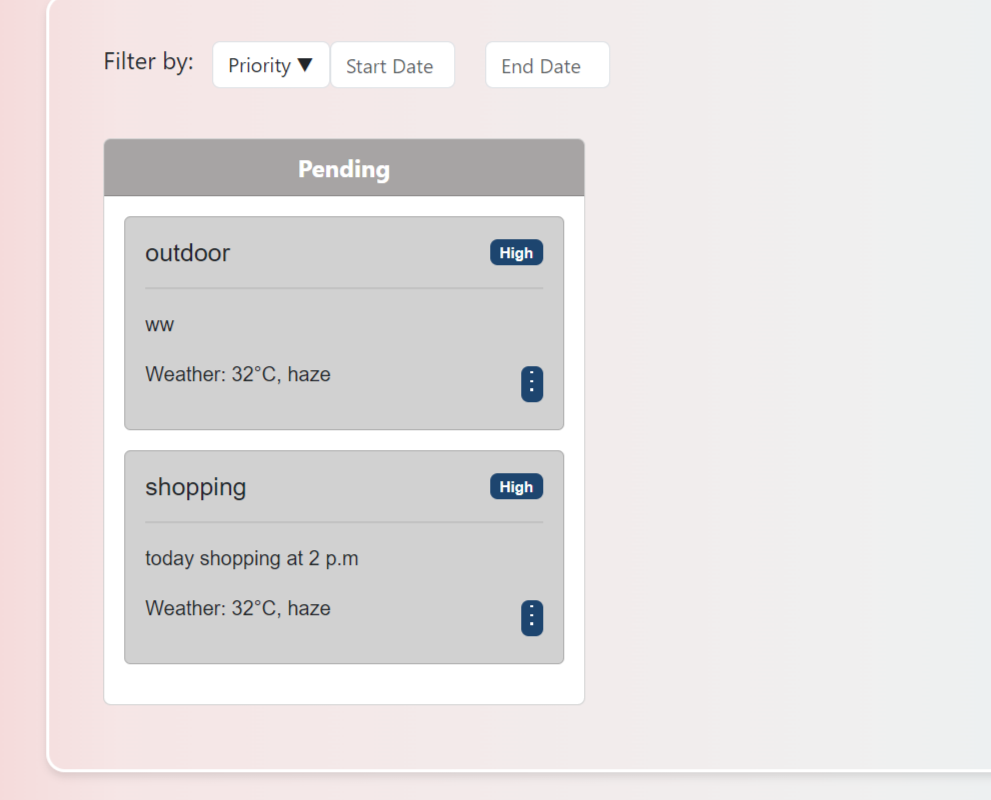

# Project Overview

This repository contains a project that requires the following steps for setup and execution.

## Setup Instructions

1. Clone the repository from the provided Git link.
2. Navigate to the project directory.
3. Run `npm install` to install dependencies.
4. Install Redux and React-Redux:
   ```bash
   npm install redux react-redux
5. npm install uuid react-datepicker react-bootstrap bootstrap 
6. npm start 

 ## Functionalites of the app:
-  We can add tasks. The task will be added in the pending state initially.
-  Users can edit and delete tasks by clicking on the three dots.
-  In the edit functionality, users can edit the priority and status of tasks only.
-  Users can delete tasks by clicking on the delete option.
-  There are three states for tasks: Pending, In Progress, and Completed.
<<<<<<< HEAD
-  OpenWeatherAPI integration has been added to fetch weather data based on location.
-  Authentication feature has been implemented using Redux for state management.
=======
-  User can change task state when ever one stage of task is done.
>>>>>>> 6e5fa5c58bd339463c7aadf31f3d01e0cef49cde
  
## Used:
- Redux is used to manage the application's state, including storing the tasks and updating the state when adding or removing tasks.
- Actions and reducers are implemented to handle the state logic.
  
## Additionally:
- the capability to mark tasks as completed without deleting them has been added, involving toggling the task's state and styling.
- Persistent storage has been implemented, saving tasks to local storage so that tasks are not lost on page reload.

## Screenshots





